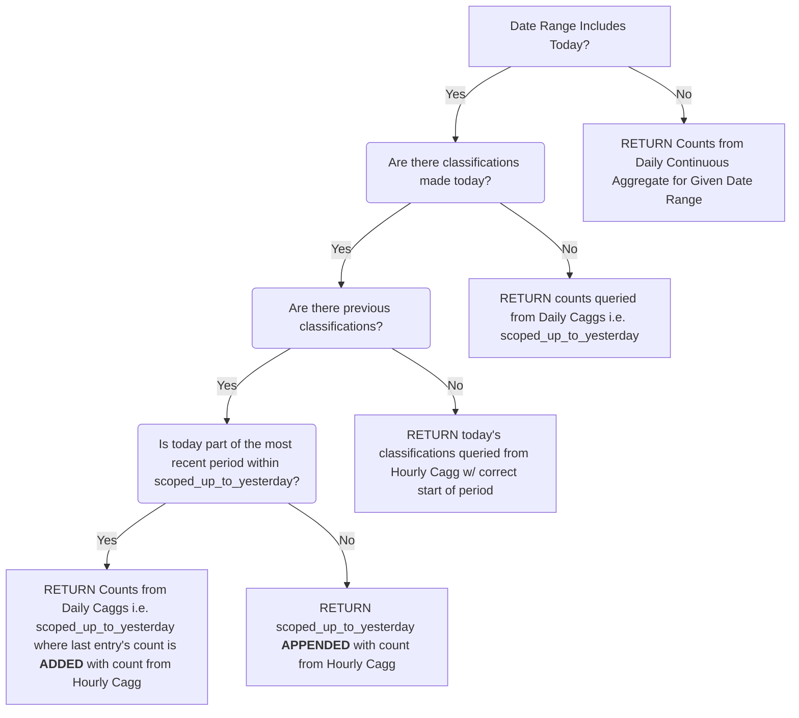

```mermaid
flowchart TD
    A[Date Range Includes Today?] -- Yes --> B(Are there classifications made today?)
    A -- No --> C[RETURN Counts from Daily Continuous Aggregate for Given Date Range]

    B -- Yes --> D(Are there previous classifications?)
    B -- No --> E[RETURN counts queried from Daily Caggs i.e. scoped_up_to_yesterday]

    D -- Yes --> F(Is today part of the most recent period within scoped_up_to_yesterday?)
    D -- No --> G[RETURN today's classifications queried from Hourly Cagg w/ correct start of period]

    F -- Yes --> H[RETURN Counts from Daily Caggs i.e. scoped_up_to_yesterday where last entry's count is <b>ADDED</b> with count from Hourly Cagg ]
    F -- No --> I[RETURN scoped_up_to_yesterday <b>APPENDED</b> with count from Hourly Cagg]

```